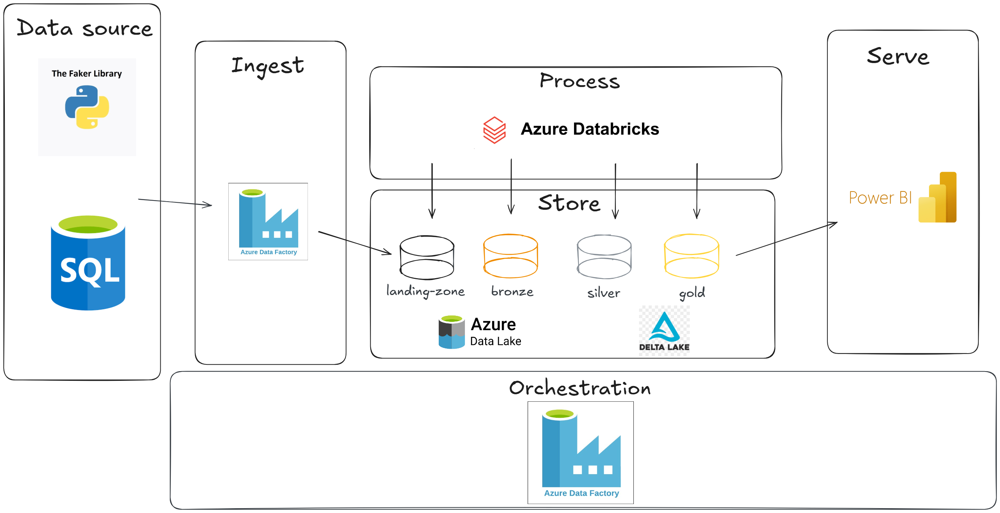

# Arquitetura do Projeto

## Visão Geral

Este projeto utiliza uma arquitetura moderna baseada em serviços gerenciados da Azure para ingestão, processamento, armazenamento e visualização de dados.

## Componentes Principais

- **Azure SQL Database**: Armazena dados transacionais.
- **Azure Data Lake Storage Gen2 (ADLS)**: Armazena dados em camadas (Landing, Bronze, Silver, Gold).
- **Azure Data Factory (ADF)**: Orquestra os pipelines de ingestão e transformação.
- **Azure Databricks**: Processa os dados em notebooks (ETL).
- **Power BI**: Conecta-se ao Silver ou Gold para criação de dashboards.

## Diagrama da Arquitetura

